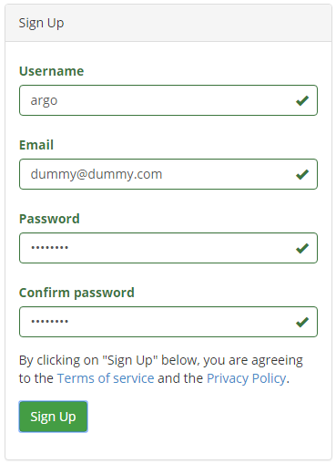
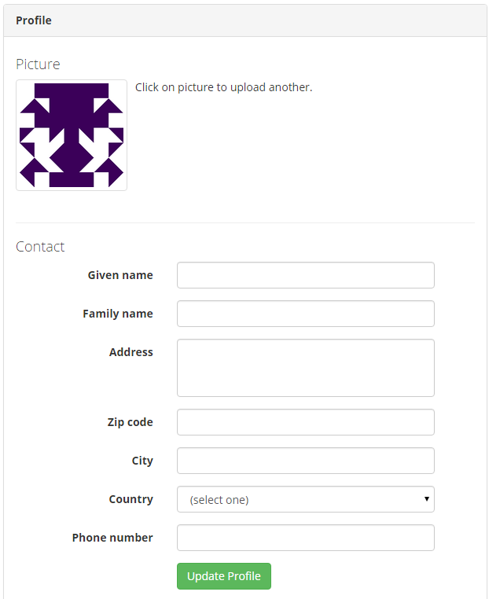
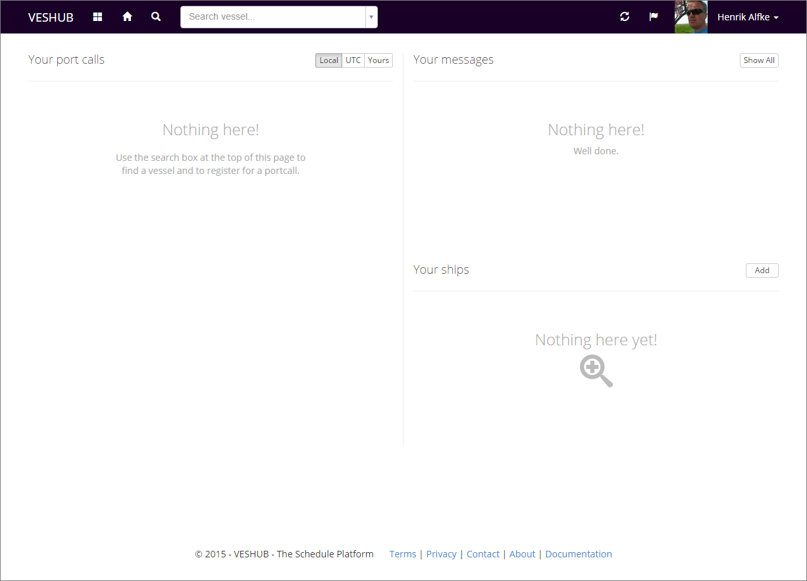
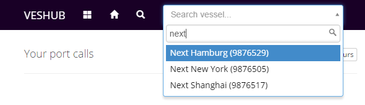
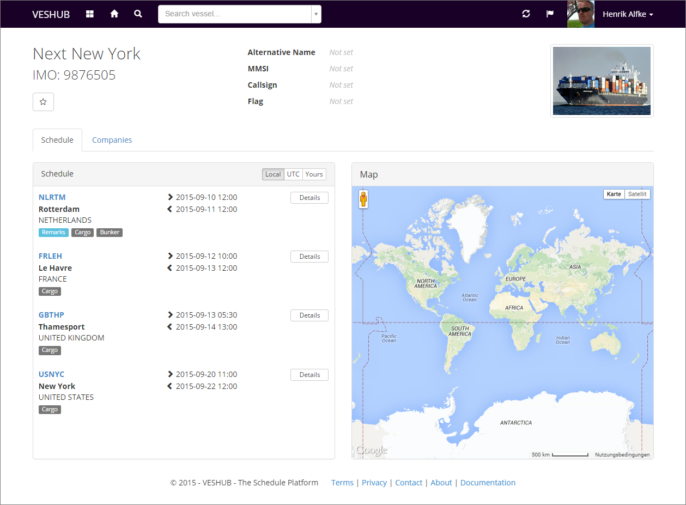
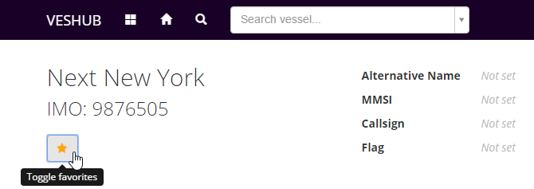
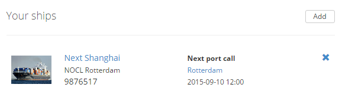
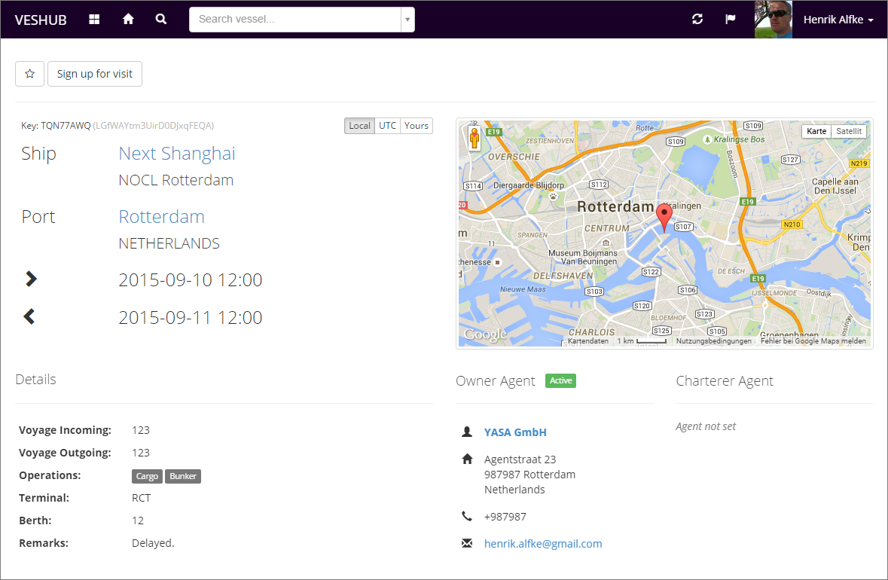
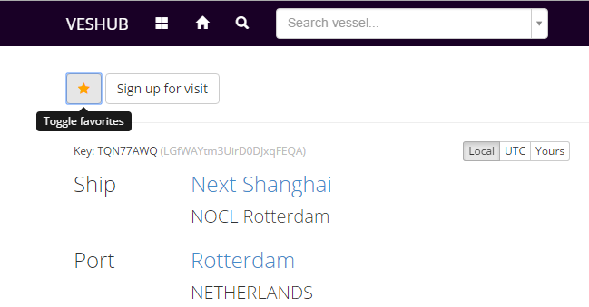
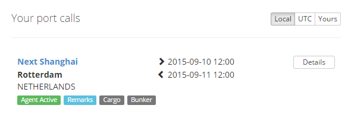

## Registration &amp; Login {#registration}

To use VESHUB you have to create you personal user account first.

1. Navigate with your browser to <http://www.veshub.com>.
1. Click on **Register** in the top-right corner.
1. Enter your personal **username** and **email**.
1. Enter a **password** and re-type it below for confirmation.
1. Confirm your input by pressing the button **Sign Up**. By doing this you will also confirm the *terms of service*.

To validate your email address we will send a confirmation email to the address you have specified. To finally activate your account you have to follow the confirmation link in this email.

The link in the email is valid for 24 hours. Please also check your spam folder if you did not receive this email. If you definitely did not received the email please contact our support (<support@veshub.com>).  

## Setting up your profile {#setting-up-profile}

After registration, your profile settings page will show up. We recommend to personalize your account now. But you can also skip this step and return later. 

**Tip:** You can open you account settings anytime via the **account menu** accessible via the **account button** on the left side of the navigation bar.
{: .well} 

All of the below steps are optional. However if you want to create your own company later you have to fill in all fields in *Contact* section.

1. To personalize your account picture, press on the pre-generated picture and select a picture file from your local drive.
2. Fill out the fields in **Contact** section and press the **Update Profile** button.
3. Fill out the fields in **Details** section as well and press the **Update Details** button.

4. Press the button **Ok, whats next?** on top of the page. This button is only available the first time you visit the profile page. If the button is not visible navigate to your dashboard use the **dashboard button**  in the navigation bar instead.

**Tip:** From all the personal data you have entered so far only your username, given name and family name are visible to other public users. You can control your [privacy settings](/account/privacy-settings.html) in your account settings.
{: .well}

## Your Dashboard {#dashboard}

The dashboard provides a quick overview over your current port call favorites and registrations, favorite ships and their next call details, recent messages and other actions which require your attention.

**Tip:** You can quickly navigate to the dashboard anytime by pressing the **dashboard button**  in the navigation bar. The button is visible while you are signed in. 
{: .well}

After login the dashboard is empty. If you did not confirm the verification email yet, it will show a message that your email address is not yet verified. The message will disappear once you have done it.

On the left side of the dashboard you will see your favorite (flagged) port calls. The area in the top right corner will show your recent unread messages. The area below the messages contains your favorite ships once you have added some. Lets do this now!

Adding a ship can be done right away within the dasboard by clicking the **Add** button. But for this tutorial we will search a vessel first.

	

## Find a Ship {#find-ship}

To quickly find a vessel, you can use the vessel search utility in the navbar. This tool is always visible while you are signed in. Simply enter the official name, alternative name, IMO number or the VESHUB key of the ship you are looking for. The search results will appear once you start typing. If the ship your are looking for is shown, select it to navigate to the vessles details page.

**Tip:** If you press the **search button**  in the navbar, the full search feature will show up. Beside ships it allows you to search for companies and users as well.
{: .well}

Once you have selected a vessel from the search box, the ships page will show up. If the user and the ship belong to the same company, more details will be available. Depending on the company role the user is assigned to, it is also possible to edit or change the details, settings etc. 

For this tutorial we assume, that the user and the ship do not share any relationship. In this case the user will only see the details which are available to the public role of the company which is managing the ship. The default settings for a new company will grant read-only access to the ship schedule and company assignment.

The header of the ships page will show the official name, IMO number and a ships picture (if uploaded by the managing company). It will also indicate some more information like alternative name, MMSI, callsign and flag if available.

Below the header you can select between different detail pages. In this example the schedule and company assignment is available. On the schedule page, the next port calls of vessel are shown in chronological order. The port (name and UN/LOCODE), country, ETA () and ETD () are included. For each call several tags provide more information for the respective call (like remarks, agent assignment, port operations etc) may be present as well.

The **Details** buttons will open the port call detail pages for each call. The time zone buttons **Local**, **UTC** and **Yours** above the port call list allow you to switch between different time zone representations of ETA and ETD.

You can try it out by clicking on the three buttons.

- **Local**: This is the local time of the respective port. When a new call is created (via manual input, onboard client or API), it is required to provide the local ETA and ETD. 
- **UTC**: This will bring up the ETA and ETD converted to UTC. The UTC time is converted from the local time provided above and the geographic position of the port. For some ports the geographic position is not available. In this case the UTC is also not available.
- **Yours**: With this selection the ETA and ETD are converted to your personal time zone. The conversion is based on the UTC time. Hence this time is also not available if UTC cannot be provided. The time zone you which to use for this option can be set in your [account settings](/account/general-settings.html). The default zone for new accounts is set to UTC as well. As long as you do not change your preference, the option UTC and Yours will show the same result.

When you select a call on the left of the page, the position will be shown on the map located on the right. If the position is not available for the respective port, the map will show the whole world.

## Add to Favorites {#add-to-favorites}

To add the current vessel to your favorite ships, press the favorite button with the star icon below the page header. The star will become yellow to indicate an active favorite. You can remove the favorite by pressing the button again.

Navigate to your dashboard using the -button in the navbar. Now the added vessel is shown in the vessel section in the bottom right corner of the dashboard. Beside the ships picture (if available), offical name, alternative name and IMO number, the port and ETA of the next call are shown. The small -button right of each ship favorite will remove the ship from your list again.

**Info:** When you add a ship to your favorite list, you will receive messages whenever something is happening with it (e.g. call has changed). You can change the notification and alert behavior in your [notification settings](/account/notification-settings.html){: .alert-link}.
{: .alert .alert-info}

## Remember a Port Call {#remember-a-port-call}

Adding ships to your favorite list is usefull if you need quick access to a fixed number of ships or if you wish to receive notifications whenever the schedule, agent or company assignment, details etc. of these ship change.

If you only wish to follow specific port calls, you can mark these calls as your favorites. Port call favorites will show up on the left side of your dashboard. As with ship favorites you will receive notifications if a call is changed, cancelled or deleted.

To mark a call as your favorite, you have to navigate to the details page of the call first:

1. Navigate to the ship details page of the ship the call belongs to.
1. Locate the call of interest in the schedule list.
1. Press the **Details** button.

Similar to the ships details page it depends on the policy settings of the managing company, your company membership and role assignment which information the call page provides to you and which actions you are allowed to do. These can be:

- Edit port call details like (ETA/ETD).
- Nominate agents or change agent details.
- View visitors and visitor requests.
- Accept or deny visitor requests.
- Accept or cancel your own agent nomination.
- Manage your own visitor requests.

As with the ship favorites above we assume for this tutorial, that the user does not have any special relation to the assigned companies of the ship. Hence the user will only see the details the managing company allows public users to see. In the default settings these are schedules and agent details.

 
Similar to the full schedule view, you can switch between the time zones for ETA and ETD. Some additional call details (voyage number, port operations, terminal, berth and remarks) are displayed in the bottom left corner. In the bottom right corner you can find the agent details if available. In this example only the owner agent is nominated and linked to the respective company. The green label *active* indicates that the agency accepted the nomination.
 
The star button on top of the page will flag the call as your favorite. The star turns orange if a call is an active favorite. Pressing the button again will remove the favorite again (similar to ship favorites).
 

If you go back to your dashboard, you will find the flagged call in your port call list sorted by ETA.

